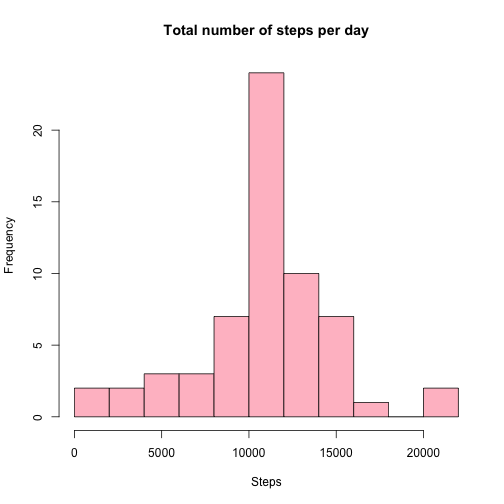

### This R Markdown file is produced for work done for the coursera course "Reproducible Research" Peer Assessment 1.

It is now possible to collect a large amount of data about personal movement using activity monitoring
devices such as a Fitbit, NikeFuelband or Jawbone Up. These type of devices are part of the "quantified self 
movement" - a group of ethusiasts who take measurements about themselves regularly to improve their health, to
find patterns in their behavior, or because they are tech geeks. But these data remain underutilized both
because the raw data are hard to obtain and there is a lack of statistical methods and software
for processing and iterpreting the data.

This assignment makes use of data from a personal activity monitoring device. This device collects data at
5 minute intervals through out the day. THe data consists of two months of data from an anonymous
individual collected during the months of October and November, 2012 and include the number of steps
taken in 5 minute intervals each day.

### Loading and preprocessing the data

Data for this assignment can be downloaded [here][1]

[1]: https://d396qusza40orc.cloudfront.net/repdata%2Fdata%2Factivity.zip "here"


```r
filename <- unzip("activity.zip")
file <- read.csv("activity.csv", stringsAsFactor = FALSE)
str(file)
```

```
## 'data.frame':	17568 obs. of  3 variables:
##  $ steps   : int  NA NA NA NA NA NA NA NA NA NA ...
##  $ date    : chr  "2012-10-01" "2012-10-01" "2012-10-01" "2012-10-01" ...
##  $ interval: int  0 5 10 15 20 25 30 35 40 45 ...
```

The variables included in this dataset are:  
* **steps** : Number of steps taking in a 5-minute interval (misssing values are coded as NA)  
* **date**: The date on which the measurement was taken in YYYY-MM-DD format  
* **interval**: Identifier for the 5-minute interval in which measurement was taken  

There is a total of 17568 observations in the dataset.

# Part 1
## Calculate the total number of steps taken per day

```r
totalSteps <- aggregate(steps ~ date, data = file, sum)
head(totalSteps)
```

```
##         date steps
## 1 2012-10-02   126
## 2 2012-10-03 11352
## 3 2012-10-04 12116
## 4 2012-10-05 13294
## 5 2012-10-06 15420
## 6 2012-10-07 11015
```

## Make a histogram of the total number of steps taken each day

```r
hist(totalSteps$steps, breaks = 8, col = "orange", 
     xlab = "Steps", main = "Total number of steps per day")
```

 

## Calculate and report the mean and median of the total number of steps taken per day

```r
meanSteps <- mean(totalSteps$steps)
medianSteps <- median(totalSteps$steps)
```
The mean is 1.0766189 &times; 10<sup>4</sup> and median is 1.0765 &times; 10<sup>4</sup>

# Part 2
## What is the average daily activity pattern?
## Make a time series plot of the 5-minute interval (x-axis) and the average number of steps
## taken, averaged across all days (y-axis)


```r
library(lubridate)
library(scales)
library(ggplot2)

avgSteps <- aggregate(steps ~ interval, data = file, mean)

time <- sprintf("%04d", avgSteps$interval)
time <- strptime(time, "%H%M")

avgStepChart <- cbind(time, avgSteps)
head(avgStepChart)
```

```
##                  time interval     steps
## 1 2015-07-09 00:00:00        0 1.7169811
## 2 2015-07-09 00:05:00        5 0.3396226
## 3 2015-07-09 00:10:00       10 0.1320755
## 4 2015-07-09 00:15:00       15 0.1509434
## 5 2015-07-09 00:20:00       20 0.0754717
## 6 2015-07-09 00:25:00       25 2.0943396
```

```r
myGP <- ggplot(avgStepChart, aes(time, steps)) +
        scale_x_datetime(breaks = ("4 hour"), labels = date_format("%H:%M")) +
        geom_line(col = "blue") +
        theme_bw() +
        labs(x = "Interval") +
        labs(y = "Average number of steps")


print(myGP)
```

 

## Which 5 minute interval, on average across all the days in the dataset contains the maximum number of steps


```r
max <- avgStepChart[which(max(avgStepChart$steps) == avgStepChart$steps), ]
print(max$interval)
```

```
## [1] 835
```
This time conicides with working hours and hence the subject is most probably going to work during 8.35am

# Part 3
## Calculate and report the total number of missing values in the dataset

```r
countNA <- sum(is.na(file$steps))
print(countNA)
```

```
## [1] 2304
```

```r
percentNA <- countNA/ nrow(file)
print(percentNA)
```

```
## [1] 0.1311475
```
0.1311475% of the data is NA

## Devise a strategy for filling in all of the missing values in the dataset.
I will input the missing values with the mean for that 5 minute interval


```r
##Create another data frame so as not to corrupt data
file1 <- file
## locate the NAs in the file
missingSteps <- is.na(file1$steps)
```

## Create a new dataset that is equal to the original dataset but with the missing data filled in

```r
avgSteps <- aggregate(steps ~ interval, data = file1, mean)

file1[missingSteps, ]$steps <- avgSteps[match(file1$interval[missingSteps], avgSteps$interval), ]$steps
```

## Make a histogram of the total number of steps taken each day and calculate and report the mean and median.
Do these values differ from the estimates from the first part of the assignment?  
What is impact of imputing missing data on the estimates of the total daily number of steps?

```r
totalSteps <- aggregate(steps ~ date, file1, sum)

hist(totalSteps$steps, breaks = 8, col = "pink", 
     xlab = "Steps", main = "Total number of steps per day")
```

 

```r
meanSteps1 <- mean(totalSteps$steps)
medianSteps1 <- median(totalSteps$steps)
print(meanSteps1)
```

```
## [1] 10766.19
```

```r
print(medianSteps1)
```

```
## [1] 10766.19
```
The mean and median did not change as a result of filling the missing values with the mean values.

# Part 4
Are there differences in activity patterns between weekdays and weekends?  
## Create a new factor variable in the dataset with two levels = "weekday" and "weekend" indicating whether a given date is a weekday of weekend day

```r
## Create a new variable so as not to corrupt the data
file4 <- file1

file4$date <- as.Date(file4$date, format = "%Y-%m-%d")

wkEnds<- c("Saturday", "Sunday")

## Check which dates are weekends
isWeekEnd <- weekdays(file4$date) %in% wkEnds
## Create an additional column to indicate if it's Weekends or Weekdays
file4$weekDay[isWeekEnd] <- c("Weekends")
file4$weekDay[!isWeekEnd] <- c("Weekdays")

avgStepsWK <- aggregate(steps ~ interval + weekDay , data = file4, mean)

time4 <- sprintf("%04d", avgStepsWK$interval)
time4 <- strptime(time4, "%H%M")

head(avgStepsWK)
```

```
##   interval  weekDay      steps
## 1        0 Weekdays 2.25115304
## 2        5 Weekdays 0.44528302
## 3       10 Weekdays 0.17316562
## 4       15 Weekdays 0.19790356
## 5       20 Weekdays 0.09895178
## 6       25 Weekdays 1.59035639
```
## Make a panel plot containing a time series plot of the 5-minute interval and the average number of steps taken, averaged across all weekday days or weekend days.  

```r
myGP4 <- ggplot(avgStepsWK, aes(time4, steps, color = weekDay)) +
        scale_x_datetime(breaks = ("4 hour"), labels = date_format("%H:%M")) +
        facet_grid(weekDay ~.) +
        geom_line() +
        theme(legend.position = "none") +
        labs(x = "Time") +
        labs(y = "Average number of steps") +
        labs(title = "Activity by weekday and weekend")

print(myGP4)
```

 

Seems that subject is waking up slightly later on weekends and ending activities later too!
